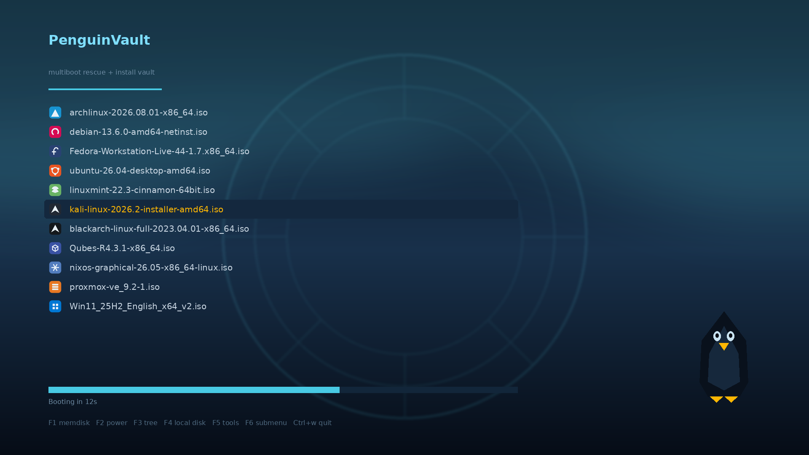

# PenguinVault

A themed [Ventoy](https://www.ventoy.net/) build: dark polar-night boot menu,
per-distro icons, a `PenguinVault` volume label instead of the default
`Ventoy`, and scripts to keep the ISOs on the drive from quietly rotting.

Ventoy does the booting. PenguinVault is the paint, the icons, and the
housekeeping around it.



## What's in here

| | |
|---|---|
| `theme/penguinvault/` | The GRUB2 theme — background, three `.pf2` fonts, 26 menu icons |
| `scripts/install.sh` | Build a PenguinVault drive from scratch (installs Ventoy, labels it, applies the theme) |
| `scripts/apply.sh` | Convert an **existing** Ventoy drive without touching its ISOs |
| `scripts/update-isos.sh` | Audit the ISOs on the drive against current upstream releases; optionally download the stale ones |
| `scripts/validate_theme.py` | Catch broken themes before they reach a boot drive |
| `scripts/make_background.py`, `make_icons.py` | Regenerate the artwork (no binary blobs to trust) |

## Usage

### Convert a Ventoy drive you already have

```sh
./scripts/apply.sh /run/media/$USER/Ventoy
```

Installs the theme and wires up the icon rules. Your ISOs, persistence
config, and any other `ventoy.json` settings are merged, not overwritten —
re-running is safe and produces no duplicates.

To also rename the volume from `Ventoy` to `PenguinVault` (needs root,
because relabelling requires the volume unmounted):

```sh
sudo ./scripts/apply.sh /run/media/$USER/Ventoy --label
```

### Build a fresh drive

```sh
sudo ./scripts/install.sh /dev/sdX          # add --gpt and/or --secure-boot
```

Fetches the current Ventoy release, installs it with `-L PenguinVault`
(Ventoy's own documented label option), then applies the theme. **This erases
the target disk** and makes you type `ERASE` to confirm — with an extra
warning if the device isn't removable.

### Keep the ISOs fresh

```sh
./scripts/update-isos.sh /run/media/$USER/PenguinVault            # audit only
./scripts/update-isos.sh /run/media/$USER/PenguinVault --update   # download stale ones
```

The audit classifies every ISO as **current**, **outdated**, or
**unverifiable**, comparing filename versions against a manifest snapshot
(`MANIFEST_DATE` at the top of the script — bump it as you refresh entries).

Rolling releases and community spins whose filenames carry no version are
reported as unverifiable rather than guessed at. Downloads go to
`<name>.part`, are checked against the project's own `SHA256SUMS` when it
publishes one next to the ISO, and only then replace the old file via an
atomic rename — a failed or corrupt download always leaves the working ISO
in place.

## Theme

Polar night: deep blue gradient, a faint vault-door ring behind the menu, an
aurora wash, and a small penguin mark. Ice cyan `#48cae4` for structure,
amber `#ffb703` for the selected entry — amber because it stays legible
against the blue for the most common forms of colour blindness, where a
green highlight would not.

Everything is generated by the scripts in `scripts/`, so you can restyle it
without trusting an opaque image:

```sh
python3 scripts/make_background.py theme/penguinvault/background.png 1920 1080
python3 scripts/make_icons.py      theme/penguinvault/icons 64
python3 scripts/validate_theme.py  theme/penguinvault
```

### Icons

`icons/<class>.png`, where `<class>` is the menu class Ventoy assigns from the
ISO filename (or from a `menu_class` rule that `apply.sh` writes into
`ventoy.json`). 26 icons cover the mainstream distros plus the odd ones.

They're simplified geometric marks in each project's brand colour rather than
copies of their logos: they stay readable at 32px, they share one visual
language so the menu looks designed rather than assembled, and nothing here
redistributes anyone's trademarked artwork. Adding one is a line in
`ICONS` in `make_icons.py` and a rule in `apply.sh`.

## Notes on specific images

- **VeloGuardOS** — **not recommended as a daily driver.** It's full of bugs,
  and its creator is on vacation, so don't expect fixes in the near term.
  Fine to boot and poke at; don't put anything you care about on it.
- **BlackArch full ISO** is still `2023.04.01`. That's not a stale copy —
  upstream simply hasn't cut a newer full image. Their own download page
  discourages the full ISO anyway and points at netinstall/slim.
- **Void Linux** live images are published rarely; `20250202` is the newest
  upstream ships even though the repos roll continuously.
- **AnduinOS** 2.x is distributed by torrent and via a website that blocks
  scripted fetches, so `--update` can't retrieve it. It's reported as
  outdated with a link, and you grab it by hand.

## Requirements

Linux, `bash`, and: `python3`, `rsync`, `wget`, `curl`, `tar`, `lsblk`.
Relabelling needs `exfatlabel` (exfatprogs) for the usual exFAT Ventoy
partition, or `fatlabel` / `ntfslabel` if you reformatted it.

The scripts check for what they need up front and refuse to start if
something's missing, rather than half-finishing.

## Credits

- [Ventoy](https://www.ventoy.net/) by longpanda — does all the actual
  multiboot work. PenguinVault is a theme and some shell scripts on top; it
  ships no Ventoy code and installs Ventoy straight from upstream releases.
- Fonts are generated with `grub2-mkfont` from
  [DejaVu Sans](https://dejavu-fonts.github.io/) (public-domain-ish
  [DejaVu license](https://dejavu-fonts.github.io/License.html)).

## License

MIT — see [LICENSE](LICENSE). Covers the scripts, theme, and generated
artwork in this repository only. Ventoy, the distributions you put on the
drive, and their logos and trademarks all remain under their own terms.
